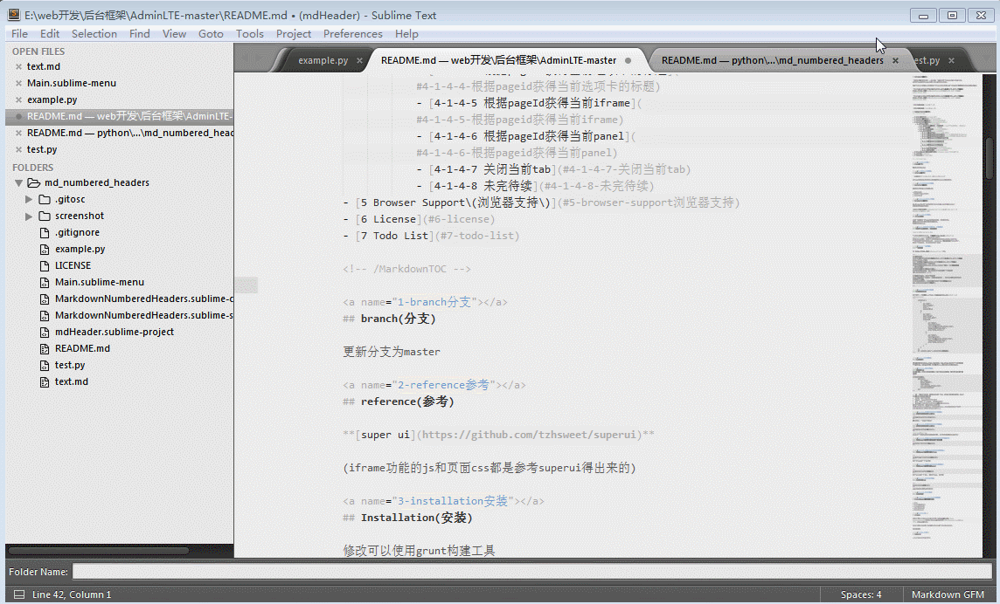

# MD_numbered_headers

sublime text3 plugiin for markdown, auto insert/update/remove header numbers  

inspired by [MarkdownTOC](https://github.com/naokazuterada/MarkdownTOC), compatible with MarkdownTOC.




## Quick Start

1. Install the plugin
1. Open your Markdown file
1. Place the cursor at the position where you want to start to numbers headers
1. Pick from menu: Tools > Markdown Numbered Headers > Insert / Update
1. And the heders in the Markdown document was numbered
1. Save the document and you are done
1. Now you can go on and edit your document further 

## Configuration

You can use attributes to customize headres nums in a single Markdown document, but if you want to keep the same configuration accross multiple Markdown documents, you can configure your own defaults.

Pick: `Sublime Text > Preferences > Package Settings > Markdown Numbered Headers > Settings - User

Example: MarkdownNumberedHeaders.sublime-settings

```
{
  "h1": 0,
  "h2": 0,
  "h3": 0,
  "h4": 0,
  "h5": 0,
  "h6": 0,
  "depth":6,
  "dottype":"-",
  "logging": true
}
```

|        Name       |  Values | default |                 means                  |
|-------------------|---------|---------|----------------------------------------|
| h1,h2,h3,h4,h5,h6 | integer | 0       | the start counting num in each num     |
| depth             | integer | 6       | define which header level start with   |
| dottype           | string  | -       | use to Separate header nums,like 1-2-3 |
| logging           | boolean | true    | show the runtime log                   |

