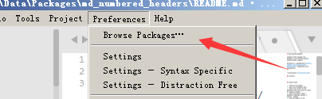

# MD_numbered_headers

sublime text3 plugiin for markdown, auto insert/update/remove header numbers  

inspired by [MarkdownTOC](https://github.com/naokazuterada/MarkdownTOC), compatible with MarkdownTOC.


<!-- MarkdownTOC -->

- [1. install](#1-install)
- [2. Quick Start](#2-quick-start)
- [3. Configuration](#3-configuration)
- [4. changelog](#4-changelog)

<!-- /MarkdownTOC -->


<a id="1-install"></a>
## 1. install

1. Preferences -> Browse Packages...  


1. `git clone https://github.com/weituotian/md_numbered_headers.git`

1. then is ok

<a id="2-quick-start"></a>
## 2. Quick Start

1. Install the plugin
1. Open your Markdown file
1. Place the cursor at the position where you want to start to numbers headers
1. Pick from menu: Tools > Markdown Numbered Headers > Insert / Update
1. And the heders in the Markdown document was numbered
1. Save the document and you are done
1. Now you can go on and edit your document further 

<a id="3-configuration"></a>
## 3. Configuration

You can use attributes to customize headres nums in a single Markdown document, but if you want to keep the same configuration accross multiple Markdown documents, you can configure your own defaults.

Pick: `Sublime Text > Preferences > Package Settings > Markdown Numbered Headers > Settings - User

Example: MarkdownNumberedHeaders.sublime-settings

```
{
  "h1": 0,
  "h2": 0,
  "h3": 0,
  "h4": 0,
  "h5": 0,
  "h6": 0,
  "depth":6,
  "dottype":"-",
  "logging": true,
  "last_number_dot":"."
}
```

| Name              | Values  | default | means                                    |
|:------------------|:--------|:--------|:-----------------------------------------|
| h1,h2,h3,h4,h5,h6 | integer | 0       | the start counting num in each num       |
| depth             | integer | 6       | define which header level start with     |
| dottype           | string  | -       | use to Separate header nums,like 1-2-3   |
| logging           | boolean | true    | show the runtime log                     |
| last_number_dot   | string  | .       | the last dot type, like 1-2-3. or 1-2-3- |

<a id="4-changelog"></a>
## 4. changelog
- v1.2.0 thanks to [Kristinita](https://github.com/Kristinita), now we can ignores the code blocks between the triple and quadruple backticks
- v1.0.3 the plugin in the Package Controll, may be older then the lastest
